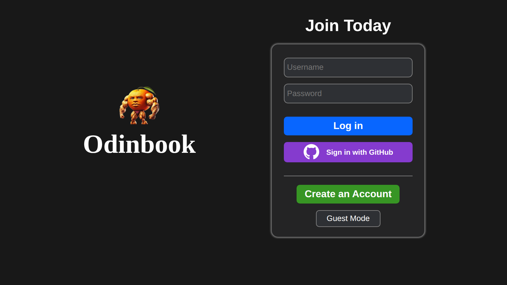
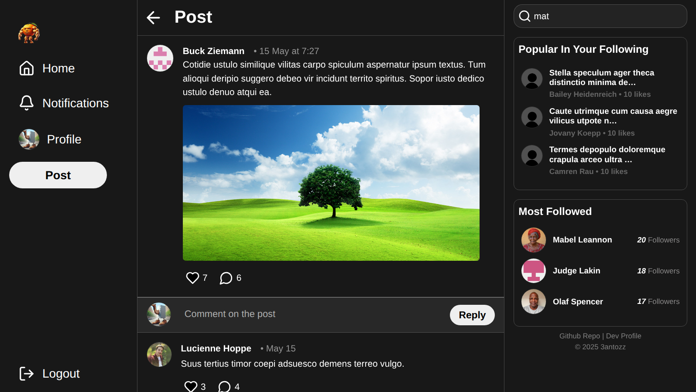
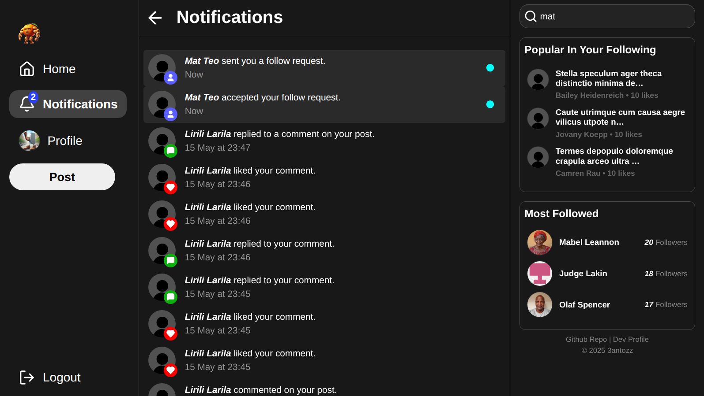
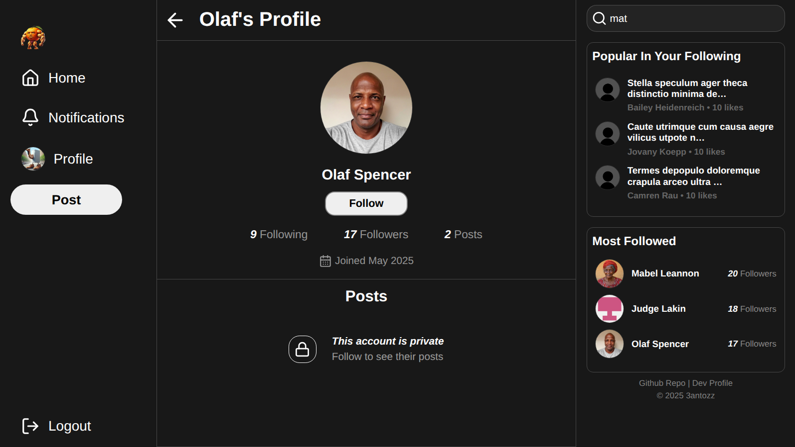
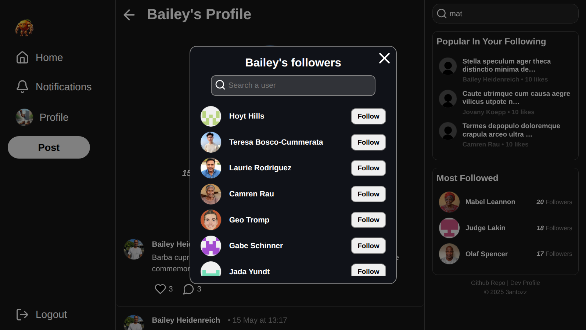

# Odinbook

A full-stack social media application built for real-time content sharing and interaction.


## Login page



## Specific Post page



## Notifications page



## User Profile



## Followers List



## Why build this project ?

This was one of the first FullStack projects I created, it's purpose was to tie everything I learned from The Odin Project's course together in a relatively complex project. Social media apps are among the most widely used applications on the web today.

## Features

- Authentification with username/password AND Github Auth (cookies based).
- Real time interaction updates (posts, follow requests, comments, likes).
- Image sharing capability.
- User connection and interaction.

## Technologies Used

### Frontend

- Javascript
- React
- Vite
- Vercel
- Socket.IO

### Backend

- Express
- Nodejs
- PostgreSQL
- Prisma ORM
- Socket.IO
- Cloudinary
- OnRender
- Aiven

## 🛠️ How to Run the Project Locally

### Prerequisites

- [Node.js](https://nodejs.org/)
- [npm](https://www.npmjs.com/)
- [PostgreSQL](https://www.postgresql.org/) (ensure your database is running)
- Basic knowledge of using a terminal (steps are beginner-friendly)

---

### 1. Clone the Repository

```bash
git clone https://github.com/3antozz/Odin-Book
cd Odin-Book
```

### 2. Setup the Backend (API)

```bash
cd api
npm install
```

> [!IMPORTANT]
> Github Authentification won't work unless you register a [Github OAuth](https://docs.github.com/en/apps/creating-github-apps/registering-a-github-app/registering-a-github-app#registering-a-github-app) application and acquire your own tokens, set ***Authorization callback URL*** field to: http://localhost:3000/auth/github/callback. Others fields may be required but are not important.

**1- Create a .env file in the api/ directory (based on .env.example) and fill in the required environment variables such as:** 

* Database connection URL
* Session secret
* Cloudinary credentials
* Github Tokens (if available)

> [!NOTE]
> Cloudinary credentials are needed to upload images, else it's not possible.

2- Start the backend server:

```bash
npm start
```
> [!NOTE]
> The backend will run on http://localhost:3000 by default.

### 3. Setup the Frontend (Client)

1- Open a new terminal window or tab:
```bash
cd client
npm install
npm run dev
```
**2- Rename the .env.example file to .env in the client/ directory**

> [!NOTE]
> The frontend will run on http://localhost:5173 by default.

### 4. Open in Browser

1- Once both servers are running:

2- Visit http://localhost:5173 in your browser

## Libraries Used

### Frontend

- [Lucide React](https://lucide.dev/guide/packages/lucide-react) – Import Icons.
- [react-virtuoso](https://virtuoso.dev/) –  React component that displays large data sets using virtualized rendering (render when visible in viewport).
- [Socket.IO](https://socket.io/) – Low-latency, bidirectional and event-based communication between a client and a server for real time updates.
- [date-fns](https://date-fns.org/docs/Getting-Started) – Used for manipulating JavaScript dates.

### Backend

- [bcryptjs](https://www.npmjs.com/package/bcryptjs) – For securing passwords by hashing and salting.
- [express-session](https://www.npmjs.com/package/express-session) – Simple session middleware for Authenticating.
- [prisma/client](https://www.npmjs.com/package/@prisma/client) – ORM - Auto-generated and type-safe query builder for Node.js.
- [prisma-session-store](https://www.npmjs.com/package/@quixo3/prisma-session-store) – An express session store implementation for the Prisma ORM.
- [passport](https://www.npmjs.com/package/passport) – Express-compatible authentication middleware for Node.js.
- [passport-local](https://www.npmjs.com/package/passport-local) – This module lets you authenticate using a username and password in your Node.js applications.
- [passport-github2](https://www.npmjs.com/package/passport-github2) – This module lets you authenticate using GitHub OAuth 2.0 in your Node.js applications. 
- [express-validator](https://www.npmjs.com/package/express-validator) – User input validation middleware.
- [cloudinary](https://cloudinary.com/) – Images storage service integration.
- [multer](https://www.npmjs.com/package/multer) – Node.js middleware for handling multipart/form-data, used for uploading files.
- [express-async-handler](https://www.npmjs.com/package/express-async-handler) – Asynchronous exception-handling middleware.
- [Socket.IO](https://socket.io/) – Low-latency, bidirectional and event-based communication between a client and a server for real time updates.
- [cors](https://www.npmjs.com/package/cors) – Package for providing a Connect/Express middleware that can be used to enable CORS.
